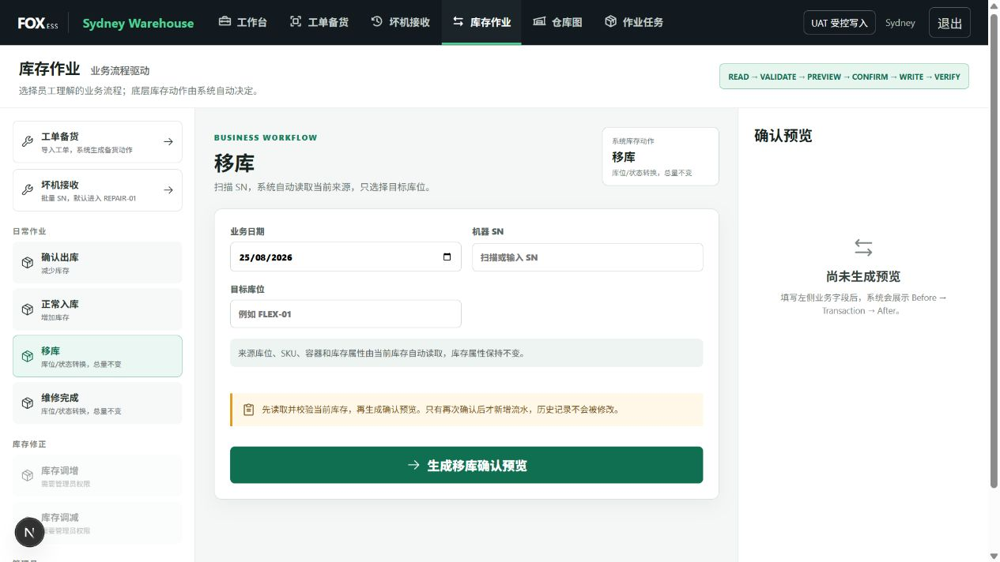
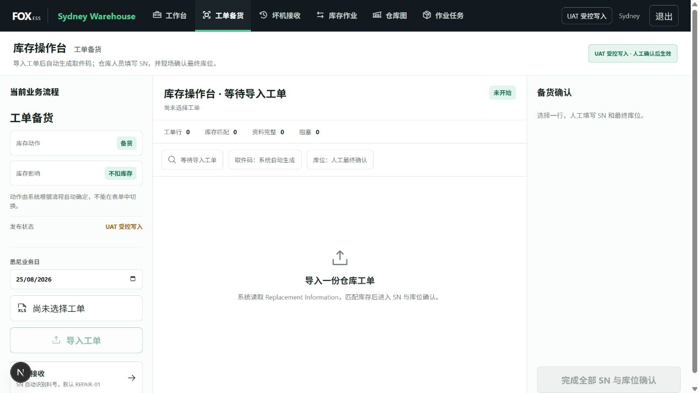

# Inventory workflow audit

## Step 1 — Inventory operations entry

Health: Good after refactor.

- Business workflows are grouped into daily work, inventory correction, and administrator operations.
- The selected workflow changes the fields, explanatory copy, system action, inventory effect, CTA, and confirmation panel.
- Adjustment and opening-balance entry points are visibly permission-gated.
- The transaction pipeline is stated and the primary action generates a preview rather than writing immediately.
- Screenshot review found no visible clipping, overlap, or unreadable control at the tested desktop viewport.

## Step 2 — Work-order preparation

Health: Good after refactor.

- The editable action selector is gone.
- The page shows fixed workflow context: 工单备货, ledger action 备货, inventory effect 不扣库存.
- The existing XLSX import, pickup-code generation, SN completion, and location-confirmation flow remains intact.
- The final preparation CTA remains disabled until all completion conditions are met.

## Highest-impact code findings

1. The previous work-order action selector only changed local React state; the confirmation service still hard-coded `备货`. It was misleading rather than functional.
2. The previous inventory transaction form accepted a ledger action directly from the browser. The route now rejects a browser-supplied `action` and derives it from `workflow` in the central Action Engine.
3. Move and repair-complete workflows now read current serialized inventory by SN. Move preserves condition; repair completion emits a controlled pending-repair decrease and repaired-good increase so one SN does not remain in both current states.
4. Adjustments require a controlled reason. `Other` also requires a remark. Opening balance requires an import/source reference and remains admin-only.
5. All writes still pass through the existing typed writer and protected-column formula verification.

## Evidence limits

- Visual review used the local operator role. Admin-only forms were verified through source/tests but were correctly disabled in the captured operator UI.
- No real Feishu inventory mutation was executed during visual QA.
- Screenshot review can identify visible accessibility risks, but keyboard order, screen-reader announcements, and color contrast require dedicated runtime testing for a compliance claim.
